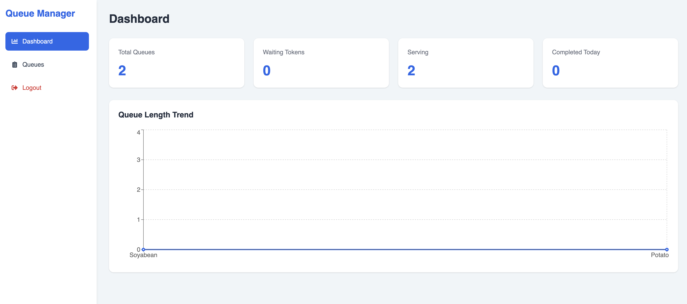

# 🎫 Queue Management System

A full-stack **Queue Management System** built using the **MERN Stack** (MongoDB, Express.js, React, Node.js). The application enables queue managers to create and manage multiple queues, issue tokens, reorder customers, serve and cancel tokens, and monitor queue performance through an interactive analytics dashboard.

### 🏠 Hero Page

---